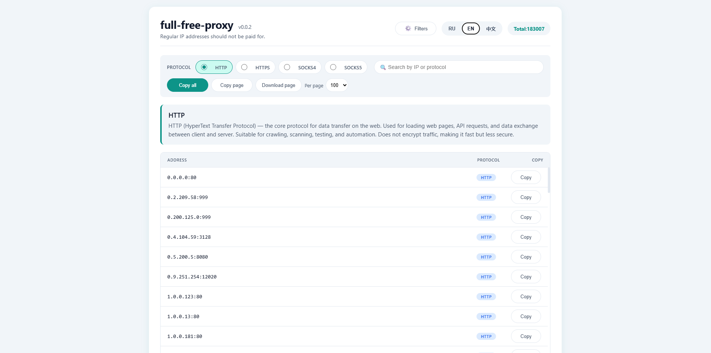

<p align="center">
  
</p>

# full-free-proxy


<details>
<summary>🇬🇧 English</summary>

## About

This tool automatically collects free proxy servers from dozens of public GitHub repositories that maintain proxy lists. It parses raw text files, normalizes entries by protocol, removes duplicates, and outputs clean lists for HTTP, HTTPS, SOCKS4, and SOCKS5.

I built this because I got tired of manually hunting for working proxies every time. It’s simple, it’s fast, and it does one thing well — just the way I like it.

## Features

- Aggregates proxies from 40+ GitHub raw sources per protocol.
- Supports HTTP, HTTPS, SOCKS4, and SOCKS5.
- Automatically strips protocol prefixes from raw data and adds the correct one.
- Uses randomized HTTP headers and timeouts to avoid blocking.
- Deduplicates all proxies and saves them into separate protocol files + a combined `all.txt`.
- Lightweight and easy to extend.

## Installation

1. Clone the repository:
   ```bash
   git clone https://github.com/just-not-google/full-free-proxy.git
   cd proxy-aggregator
   ```

2. Install required Python packages:
   ```bash
   pip install requests
   ```

## Usage

Run the main script:
```bash
python -m github_raw
```

This will:
- Fetch all proxy lists from the URLs defined in `github_raw_url_list.py`.
- Process each line, removing any existing protocol prefixes and adding the target protocol.
- Write unique proxies to `http.txt`, `https.txt`, `socks4.txt`, `socks5.txt`.
- Write all unique proxies (regardless of protocol) to `all.txt`.

## Project Structure

```
├── parsers/
│   ├── __init__.py
│   ├── github_raw_url_list.py     # Contains all GitHub raw URLs grouped by protocol
│   ├── template_requests.py       # HTTP request handler with random headers/timeouts
│   └── data/
│       ├── __init__.py            # Exports constants
│       ├── header_list.py         # List of realistic browser headers
│       ├── main_constants.py      # Timeout ranges
│       ├── protocols.py           # Protocol string constants
│       ├── protocol_names.py      # Mapping protocol -> output filename
│       └── replace_proxy.py       # Controls whether to strip prefixes (always True)
├── github_raw.py                  # Main logic: fetch and process lists
```

## Configuration

- **Add or remove sources**: Edit `github_raw_url_list.py` – each key is a protocol (`HTTP_PROTOCOL`, etc.), and the value is a list of raw GitHub URLs.
- **Change output filenames**: Modify `protocol_names.py`.
- **Adjust timeouts**: Change `MIN_TIMEOUT` and `MAX_TIMEOUT` in `main_constants.py`.
- **Disable prefix replacement**: Set `REPLACE_PROXY[protocol] = False` in `replace_proxy.py`.

## WebSite

A minimalistic but also user-friendly website that is updated via GitHub Actions. Nothing superfluous, so as not to distract from the main thing - from the IP proxy.

<p align="center">
  
</p>

## Output Files

After execution, the following files will be created in the project root:
- `http.txt`   – HTTP proxies (format: `http://ip:port`)
- `https.txt`  – HTTPS proxies (`https://ip:port`)
- `socks4.txt` – SOCKS4 proxies (`socks4://ip:port`)
- `socks5.txt` – SOCKS5 proxies (`socks5://ip:port`)
- `all.txt`    – All unique proxies from all protocols, sorted.

Each file contains one proxy per line.

## Dependencies

- Python 3.6+
- `requests` library

</details>

<details>
<summary>🇷🇺 Русский</summary>

## О проекте

Этот инструмент автоматически собирает бесплатные прокси-серверы из десятков публичных репозиториев GitHub, которые поддерживают списки прокси. Он парсит сырые текстовые файлы, нормализует записи по протоколу, удаляет дубликаты и выдает чистые списки для HTTP, HTTPS, SOCKS4 и SOCKS5.

Я сделал это, потому что устал вручную искать рабочие прокси каждый раз. Всё просто, быстро и делает одну вещь хорошо — именно так, как я люблю.

## Возможности

- Собирает прокси из 40+ источников GitHub для каждого протокола.
- Поддерживает HTTP, HTTPS, SOCKS4 и SOCKS5.
- Автоматически удаляет протоколы из сырых данных и добавляет нужный.
- Использует случайные заголовки и таймауты, чтобы избежать блокировок.
- Удаляет дубликаты и сохраняет отдельные файлы по протоколам + общий `all.txt`.
- Легковесный и легко расширяемый.

## Установка

1. Клонируйте репозиторий:
   ```bash
   git clone https://github.com/just-not-google/full-free-proxy.git
   cd proxy-aggregator
   ```

2. Установите необходимые пакеты:
   ```bash
   pip install requests
   ```

## Использование

Запустите основной скрипт:
```bash
python -m github_raw
```

Что произойдёт:
- Будут загружены все списки из URL-адресов, указанных в `github_raw_url_list.py`.
- Каждая строка будет обработана: удалены существующие префиксы протоколов и добавлен целевой протокол.
- Уникальные прокси будут записаны в `http.txt`, `https.txt`, `socks4.txt`, `socks5.txt`.
- Все уникальные прокси (без привязки к протоколу) будут записаны в `all.txt`.

## Структура проекта

```
├── parsers/
│   ├── __init__.py
│   ├── github_raw_url_list.py     # Список URL-адресов GitHub, сгруппированных по протоколам
│   ├── template_requests.py       # Обработчик HTTP-запросов со случайными заголовками и таймаутами
│   └── data/
│       ├── __init__.py            # Экспорт констант
│       ├── header_list.py         # Список реалистичных заголовков браузера
│       ├── main_constants.py      # Диапазоны таймаутов
│       ├── protocols.py           # Константы строк протоколов
│       ├── protocol_names.py      # Соответствие протокол -> имя выходного файла
│       └── replace_proxy.py       # Управление удалением префиксов (всегда True)
├── github_raw.py                  # Основная логика: загрузка и обработка
```

## Настройка

- **Добавление или удаление источников**: отредактируйте `github_raw_url_list.py` – ключ — это протокол (`HTTP_PROTOCOL` и т.д.), значение — список URL-адресов.
- **Изменение имён выходных файлов**: измените `protocol_names.py`.
- **Настройка таймаутов**: измените `MIN_TIMEOUT` и `MAX_TIMEOUT` в `main_constants.py`.
- **Отключение замены префиксов**: установите `REPLACE_PROXY[protocol] = False` в `replace_proxy.py`.

## Веб-сайт

Минималистичный, но также и удобный сайт, который обновляется через GitHub Actions. Ничего лишнего, чтобы не отвлекало от главного - от айпи прокси.

<p align="center">
  
</p>

## Выходные файлы

После выполнения в корне проекта будут созданы:
- `http.txt`   – HTTP-прокси (формат: `http://ip:port`)
- `https.txt`  – HTTPS-прокси (`https://ip:port`)
- `socks4.txt` – SOCKS4-прокси (`socks4://ip:port`)
- `socks5.txt` – SOCKS5-прокси (`socks5://ip:port`)
- `all.txt`    – Все уникальные прокси из всех протоколов, отсортированные.

Каждый файл содержит по одному прокси на строку.

## Зависимости

- Python 3.6+
- Библиотека `requests`

</details>

<details>
<summary>🇨🇳 中文</summary>

## 关于本项目

本工具会自动从数十个维护代理列表的公开 GitHub 仓库中收集免费代理服务器。它会解析原始文本文件，按协议规范化条目，去除重复项，并输出干净的 HTTP、HTTPS、SOCKS4 和 SOCKS5 列表。

我做这个工具是因为每次都要手动寻找可用的代理实在太烦了。它简单、快速，只把一件事做好 —— 正是我喜欢的风格。

## 功能特性

- 每个协议从 40+ 个 GitHub 原始来源聚合代理。
- 支持 HTTP、HTTPS、SOCKS4 和 SOCKS5。
- 自动从原始数据中去除协议前缀并添加正确的前缀。
- 使用随机 HTTP 请求头和超时以避免被封禁。
- 对所有代理去重，并保存为按协议划分的文件 + 合并的 `all.txt`。
- 轻量且易于扩展。

## 安装

1. 克隆仓库：
   ```bash
   git clone https://github.com/just-not-google/full-free-proxy.git
   cd proxy-aggregator
   ```

2. 安装所需的 Python 包：
   ```bash
   pip install requests
   ```

## 使用方法

运行主脚本：
```bash
python -m github_raw
```

它将：
- 从 `github_raw_url_list.py` 中定义的 URL 获取所有代理列表。
- 处理每一行，去除已有的协议前缀并添加目标协议。
- 将唯一的代理写入 `http.txt`、`https.txt`、`socks4.txt`、`socks5.txt`。
- 将所有唯一的代理（无论协议）写入 `all.txt`。

## 项目结构

```
├── parsers/
│   ├── __init__.py
│   ├── github_raw_url_list.py     # 包含按协议分组的所有 GitHub 原始 URL
│   ├── template_requests.py       # 带随机请求头和超时的 HTTP 请求处理器
│   └── data/
│       ├── __init__.py            # 导出常量
│       ├── header_list.py         # 逼真的浏览器请求头列表
│       ├── main_constants.py      # 超时范围
│       ├── protocols.py           # 协议字符串常量
│       ├── protocol_names.py      # 协议 -> 输出文件名的映射
│       └── replace_proxy.py       # 控制是否去除前缀（始终为 True）
├── github_raw.py                  # 主逻辑：获取并处理列表
```

## 配置

- **添加或删除来源**：编辑 `github_raw_url_list.py` —— 每个键是一个协议（`HTTP_PROTOCOL` 等），值是原始 GitHub URL 的列表。
- **修改输出文件名**：修改 `protocol_names.py`。
- **调整超时**：修改 `main_constants.py` 中的 `MIN_TIMEOUT` 和 `MAX_TIMEOUT`。
- **禁用前缀替换**：在 `replace_proxy.py` 中设置 `REPLACE_PROXY[protocol] = False`。

## 网站

一个极简但同样易用的网站，通过 GitHub Actions 自动更新。没有多余的东西，以免分散对核心内容的注意力 —— 也就是 IP 代理。

<p align="center">
  
</p>

## 输出文件

执行后，项目根目录下将创建以下文件：
- `http.txt`   – HTTP 代理（格式：`http://ip:port`）
- `https.txt`  – HTTPS 代理（`https://ip:port`）
- `socks4.txt` – SOCKS4 代理（`socks4://ip:port`）
- `socks5.txt` – SOCKS5 代理（`socks5://ip:port`）
- `all.txt`    – 所有协议的去重代理，已排序。

每个文件每行包含一个代理。

## 依赖

- Python 3.6+
- `requests` 库

</details>
